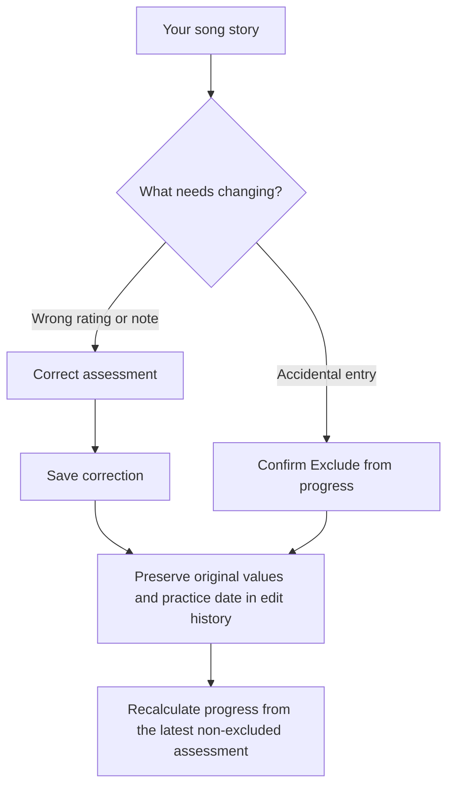

# Little Piano v0.2 plan

Status: implemented locally as v0.2.0. Migration 007, UI workflows, and automated checks are in place. No remote migration or deployment has been performed. The scope and acceptance criteria below record the design.

Local verification: 43 unit tests, 127 PostgreSQL/PGlite checks, and 17 browser tests pass; the production build passes. Mobile and desktop screenshots were inspected. Live Google login, deployed permissions, actual-device printing, and simultaneous independent PostgreSQL sessions still require release verification. No local PostgreSQL/Supabase server was available for the last check.

## Goal and scope

Make everyday corrections and book management possible for the adult using the app, while preserving saved progress and issued certificates.

| Priority | Feature | User outcome |
| --- | --- | --- |
| 1 | Edit child profile | Correct the child's name without creating another account |
| 2 | Archive and restore books | Keep the active shelf tidy without losing history |
| 3 | Correct or exclude assessments | Fix accidental scores and notes with a visible edit history |

Keep the current one-child-per-account model and Vue-to-Supabase architecture. Multiple children, shared teacher access, custom catalogues, practice reminders, progress charts, exports, and account deletion remain future work.

## 1. Edit child profile

- Add an **Edit profile** action beside the child's name on My Books.
- Show the current name with **Save changes** and **Cancel**. Trim input and enforce the existing 1–80 character limit in the UI and database.
- Update the shelf and defaults for new certificates after a successful save. Keep the form open with an error if saving fails.
- Previously issued certificates retain their saved name snapshots. Explain this beside the form.
- Permit owners to update only `students.display_name`; keep IDs, ownership, and creation timestamps immutable. Add an owner-scoped UPDATE policy with both USING and WITH CHECK conditions.

Acceptance: a renamed profile survives refresh; cancelling changes nothing; another account cannot rename it; existing certificates are unchanged and new certificate drafts use the new name.

## 2. Archive and restore books

- Add **Archive book** to the book screen, with confirmation explaining that history and certificates remain saved.
- Show **Active books** by default and an **Archived books** view with **Restore book**.
- Allow archived books to be opened to review progress and history. Require restoration before recording new practice assessments or issuing a new book-related award. Corrections to existing assessments remain available.
- Preserve the selected-book row and reuse its existing `archived_at` column. Restoring clears that field; never insert a second selection for the same book.
- Keep archived selections out of the add-book chooser; direct users to Archived books to restore them. Previously selected catalogue editions remain restorable even when no longer offered for new selection.
- Existing certificates remain viewable, downloadable, printable, and deletable after archiving. An **Issue another** action for an archived book should explain how to restore it first.
- Use owner-checked database functions for archive/restore, recording archive time on the server and granting no general UPDATE permission on book relationships.
- Enforce the archived-book rule for new assessments and book-related certificates in the database, including direct API requests. Coordinate writes on the selected-book row so archiving and a concurrent insert have a consistent order.

Acceptance: archive/restore survives refresh, preserves ratings and certificates, works for legacy editions, cannot create duplicate selections, and cannot modify another user's books. Failed requests leave the current shelf unchanged.

## 3. Correct assessments without losing the original

### User experience

- Add **Correct assessment** to each entry in Your song story. Prefill the three ratings and feedback; provide **Save correction** and **Cancel**.
- Add **Exclude from progress** for an accidental entry, with confirmation. Display it as excluded in history and offer **Restore assessment**.
- Label corrected entries and provide **View edit history** showing original and subsequent values.
- Keep **Save this moment** for a new practice assessment. Explain that a correction fixes an existing entry and preserves its original practice date.
- Excluding the newest assessment makes the previous non-excluded assessment current. Excluding all assessments makes the song unassessed. Restoring an assessment reuses its original position in history.
- Correcting an older assessment must never make it newer than a later practice assessment. Certificates are unaffected by any correction or exclusion.

### Data and API design

- Keep `assessments` as immutable original records. Add an append-only `assessment_revisions` table containing revision ID, assessment ID, revision number, full rating/feedback snapshot, exclusion state, and server timestamp. Existing assessments require no destructive conversion.
- Add an owner-checked, transactional database function called through `supabase.rpc(...)`. Lock the target assessment, validate ownership and values, and append the next revision. Do not allow browser clients to insert revisions directly or update/delete originals.
- Give each submission a stable revision UUID for retry recovery. Enforce unique `(assessment_id, revision_number)` and UUID values. A repeat request with the same UUID and payload returns the saved result; conflicting reuse is rejected.
- Require the expected revision number. If another tab saved first, return a conflict and ask the user to reload before resubmitting. Check idempotent retry recovery before treating a retry as a stale-version conflict.
- Provide an RLS-respecting effective-assessments view combining each original with its newest revision, falling back to original values. Preserve original `assessed_at` and ID for ordering; show revision timestamps only as edit metadata.
- Update `latest_assessments` to use effective values and omit excluded entries. Update frontend latest/progress/history calculations to match. Keep excluded entries visible in the history UI.
- Enable RLS on revisions and test cross-account isolation for tables, views, and functions. Any privileged function must use a fixed search path, explicit ownership checks, and restricted execution grants.

Acceptance: edits, exclusions, and restores survive refresh; history preserves originals; latest progress is correct for old and new entries; retries do not duplicate revisions; simultaneous edits report conflicts; forged ownership, timestamps, relationships, and invalid scores are rejected.

## Implementation sequence

1. **Profile editing:** add a new migration after migration 006, implement the form, and verify ownership and certificate snapshots.
2. **Book archiving:** add archive/restore functions and insertion guards; update book types, shelf filters, book screens, and certificate forms together.
3. **Assessment corrections:** add revision storage/functions/views, then implement correction, exclusion, restore, and edit-history screens. Update retry recovery to use effective values when returning an already-saved original assessment.
4. **Release preparation:** update the README usage diagrams and setup instructions, reconcile old append-only/no-UPDATE descriptions with the new narrowly permitted actions, and bump the package version to 0.2.0.

Use new timestamped migrations; do not rewrite previously applied migrations. Preserve existing IDs, ratings, selections, and certificate snapshots. No catalogue reseed or separate application server is needed for these features.

## Verification and release

- Unit checks: archive filtering, latest effective scores, exclusions/restores, original-date ordering, and input validation.
- Database checks: migrate a populated v0.1 fixture; verify data preservation, owner/anonymous/unrelated-account permissions, immutable columns, retries, conflicting edits, and all new views/functions. Extend the existing PGlite suite; check concurrent transactions against a local Supabase/PostgreSQL instance where needed.
- Browser checks: profile rename/cancel/error; archive/restore and certificate behavior; correction/exclusion/restore/history, double-clicks, ambiguous saves, and stale edits. Cover phone and desktop layouts with isolated fixtures.
- Run `npm.cmd run check` and `npm.cmd run test:browser` before release. Both passed during local implementation.
- Before production, verify Google login and cross-account isolation against the deployed policies, and repeat PDF download/printing checks on an actual phone.
- Apply migrations in a test environment and verify the matching frontend before production. Review backups and the migration diff before applying production changes.
- Profile changes are additive. Archiving guards affect old clients, and corrections change how progress is interpreted: deploy the matching frontend with those migrations and prompt already-open sessions to refresh. Do not treat rolling back to v0.1 as safe once archives or revisions exist; use a compatible frontend rollback or a forward fix that preserves records.

Done means all three workflows pass their acceptance checks, existing data remains intact, updated usage instructions match the app, and the release has passed live authentication and permissions checks.
