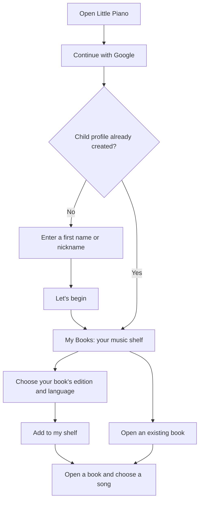
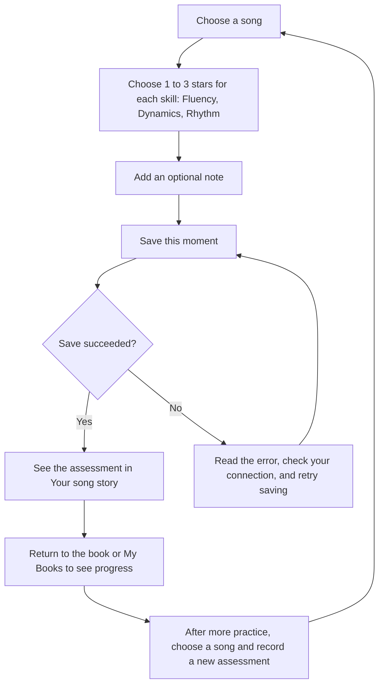
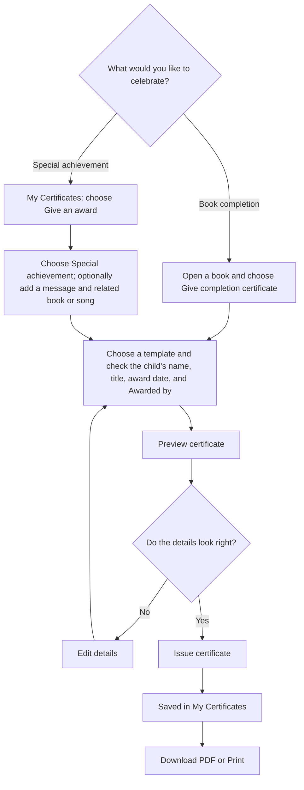

# Little Piano

A Vue 3 + Vite + TypeScript app for one child using their adult’s Google session. Choose books, award separate 1–3 stars for Fluency, Dynamics, and Rhythm with optional feedback, and keep every assessment. No assessment is distinct from one star. Progress uses the **latest** assessment, not the highest score.

## How to use the app

Open the app URL supplied by the person who set it up. For local use, follow [Run locally](#run-locally) first. An adult signs in with Google; each account has one child profile. Use the same Google account each time to return to your saved books, assessments, and certificates.

### Sign in and choose a book



Match the book to your printed copy. A **Partial song list** notice means progress covers only the listed entries.

### Record practice and see progress



| Stars | Meaning |
| --- | --- |
| 1 | Getting started |
| 2 | Almost there |
| 3 | Well learned |

Choose a score for **all three skills** before saving. **Not assessed** means no rating has been saved. Each save adds a new assessment to the history; it does not replace earlier ones. Progress uses the **latest** assessment, even if its scores are lower. A song counts as well learned when all three scores in its latest assessment are 3.

### Create, download, and print certificates



An adult decides when to give an award: **book completion certificates do not require any assessments or minimum scores**, and awards do not change song ratings. You can also choose **Book completion** from the **Give an award** form; add the book to **My Books** first.

Previewing does not save an award; choose **Issue certificate** to save it. Return to **My Certificates** to reopen, download, or print it later. If printing is blocked, allow the new tab or download the PDF and print it from your PDF viewer. On a phone, use the viewer's Print/Share menu if needed.

Saved certificate details cannot be edited. To correct a mistake, choose **Delete certificate**, confirm the deletion, and issue a new award. Downloaded copies are unaffected. Use **Issue another** when you intentionally want another award.

### Returning later or getting help

- Sign in with the same Google account to continue with your saved profile.
- If loading fails, use **Reload data** or **Try again** after checking your connection.
- If the app asks for a Supabase connection, the person setting it up needs to complete the setup sections below.
- Choose **Sign out** when finished on a shared device.

The diagrams above use Mermaid. View this README in a Markdown viewer with Mermaid support, such as GitHub, to see the flowcharts.

## Run locally

Requires Node 22.12+ (tested with Node 24) and npm. In Windows PowerShell, use `npm.cmd` if script execution policy blocks `npm`.

```powershell
npm.cmd ci
Copy-Item .env.example .env.local
# Edit .env.local with your project URL and publishable key.
npm.cmd run dev
```

Open `http://127.0.0.1:5173`. The app displays setup instructions until configured. It never substitutes demo data for missing configuration or failed cloud requests.

```dotenv
VITE_SUPABASE_URL=https://YOUR-PROJECT.supabase.co
VITE_SUPABASE_PUBLISHABLE_KEY=YOUR-PUBLISHABLE-KEY
```

Find these in your Supabase project’s connection/API settings. These two browser-facing values are sufficient. `.env.local` is ignored. Never put database passwords, service-role keys, secret API keys, Google client secrets or administrative tokens in frontend variables or source control. Restart Vite after changes. No remote changes have been made by the agent.

## Database setup — review before applying

Apply the four files in `supabase/migrations/` in filename order: `202609240001_initial.sql`, `202609240002_catalogue_selection.sql`, `202609250003_assessment_dimensions.sql`, then `202609250004_family_catalogue_sources.sql`. Skip any already applied. The third migration replaces the single overall score with three required scores. It expects no assessment records (as confirmed during design) and safely refuses to proceed if any exist; it never deletes them. The fourth permits explicit family-photo source identifiers alongside publisher HTTPS URLs; no photos are uploaded or made public. It targets Supabase PostgreSQL 15+ and relies on `auth.users`, `auth.uid()`, `anon` and `authenticated` supplied by Supabase.

For your existing free project, **when you are ready to apply it yourself**:

1. Review the migrations. In Supabase SQL Editor, run each pending file once, in order. Do not run it twice; future schema changes should be new timestamped migrations.
2. Run `npm.cmd run seed:generate` locally. This only generates `supabase/seeds/catalogue.sql`; it does not connect to any database.
3. Review the generated SQL, then run its contents in SQL Editor. The catalogue seed can be reapplied. Stable UUIDs and upserts preserve song references and assessments; no private rows are touched.

If using the Supabase CLI migration workflow instead, initialize the local CLI configuration, apply the migration to a local development instance first, and configure `[db.seed] sql_paths = ["./seeds/catalogue.sql"]`. Keep remote migration/deployment as a separate explicitly approved operation. Do not mix untracked SQL Editor changes with CLI migration history without reconciling that history.

The seed intentionally does not remove older catalogue rows. For a correction, keep each existing book/song key stable, modify metadata, regenerate, and review. The seed moves existing song orders to a temporary unused range within the same transaction before importing the reviewed order, avoiding `(book_id, sort_order)` collisions. Do not change song IDs to work around this: old assessments reference them.

## Google sign-in

Follow [Supabase’s Google provider guide](https://supabase.com/docs/guides/auth/social-login/auth-google).

1. In Google Auth Platform, configure a consent screen and a Web application OAuth client. For an initial private test, add your adult Google account as an allowed test user.
2. Add `http://127.0.0.1:5173` as a JavaScript origin. Add the **Supabase callback URL** shown on its Google provider page as Google’s authorized redirect URI (typically `https://YOUR-PROJECT.supabase.co/auth/v1/callback`).
3. Enable Google in Supabase Authentication → Providers and enter the Google client ID and secret **there**, never in this app.
4. In Supabase URL configuration, set the local Site URL and allow `http://127.0.0.1:5173/` as an app redirect. If using `localhost`, allow that exact origin too.
5. Sign in, create a nickname, then select a book. The child stays within your session. Keep anonymous sign-ins and unused providers disabled.

There is one child per owner enforced by a unique constraint. Other authenticated accounts cannot access your child; there are no invitations, shared adults or roles. The Google test-user audience can restrict this initial installation to your account. The app is not an account-management product.

## Data and access rules

All six base tables have RLS. Catalogue tables are authenticated-read-only. Students, selected books and assessments are scoped through the child’s owner. Browser clients have only the column-level INSERT grants needed by the app, plus SELECT; no UPDATE or DELETE grants. Ownership, book relationships, creation timestamps and assessment history cannot be rewritten through the client. Account removal and corrections are outside this MVP UI.

The assessment insert trigger rejects any song outside the selected book and stamps server time. Fluency, dynamics, and rhythm are each required database-constrained integers from 1 to 3. There is no combined score. A song is well learned only when all three latest scores are 3. History remains append-only for future assessments. A stable per-submission UUID prevents a repeated network submission from creating another row; the UI also disables saving while a request is running. New intentional assessments receive new IDs.

`latest_assessments` uses `security_invoker=true`, so base-table RLS still applies. The app derives latest ratings from its loaded history using the same timestamp-descending/ID-descending tie break. Queries are paginated to avoid silently truncating history at the API row limit. Supabase’s authenticated client performs every normal operation. See [Supabase RLS documentation](https://supabase.com/docs/guides/database/postgres/row-level-security).

## Catalogue status

**9 books, 464 entries. My First A/B/C retain their complete page-indexed learning lists. All six Level 1, 2A and 2B books are reconciled against the family’s Progress Chart photos. All nine retained books now have chart-level coverage; edition and subsection limitations are documented below. Levels 3 and 4–5 are removed from the active catalogue.** See the review checklist for all titles, verified pages, unknown pages, and sources.

See [the coverage report](catalogue/COVERAGE.md) for counts, source URLs, edition details and missing information. The new seed hides the eight earlier US books from the chooser while retaining existing references. Those editions are archived in `catalogue/legacy-us.mjs`; a fresh seed imports only the requested 13.

Only metadata is stored. All book graphics in the UI are original CSS typography/shapes, not publisher covers. There are no sheet music files or recordings. Test fixtures live under `tests` / the test harness and are never imported into the real catalogue or application.

## Verification

```powershell
npm.cmd run typecheck
npm.cmd run build
npm.cmd test
npm.cmd run test:db
npm.cmd run test:browser
```

- Unit suite: 26 cases for catalogue reconciliation, latest selection, ties, book/song isolation, unassessed vs one star, and input validation.
- Database suite: 59 checks running the **actual migration and seed in PGlite (PostgreSQL WASM)**. Tests create isolated Auth-compatible users and JWT subject settings, then switch to actual database roles. They cover saving/reloading, newest rather than highest rating, repeated seeds, duplicate submissions, invalid/fractional stars, wrong-book songs, anonymous denial, unrelated-account denial, forged ownership, relationship changes, immutable history, forged timestamps, and the RLS-respecting latest view. Nothing is sent to a remote database.
- Browser suite: six Playwright tests using isolated request fixtures. Tests cover sign-in gating; profile creation, book selection, double-submit protection, save/reload and history at 390/768/1280px; load errors; and save-error retry. It uses installed Google Chrome (`channel: 'chrome'`). To use Playwright Chromium, remove that setting and run `npx playwright install chromium`. Test fixtures are not proof of Supabase transport or OAuth correctness; the database suite separately exercises SQL security.
- Browser screenshots are written under ignored `test-results/` for layout review. Fonts use optional Google Fonts with system fallbacks.

On this Windows workspace, Playwright’s web-server teardown waited after the six test cases finished; stopping the Vite processes created by that test run allowed a clean exit (`6 passed`). If this occurs locally, stop only the test server on port 5174. You can also start a dedicated fixture-configured test server yourself and set `PLAYWRIGHT_REUSE_SERVER=1` for the test command. Never use real credentials on that fixture server.

**Still requires a configured Supabase environment:** a real Google consent/callback round trip; real PostgREST requests with project keys; session expiration/refresh; and cross-account checks against the deployed policies. Local SQL tests prove the migration behavior, not that the migration has been applied to your project. No remote migration, OAuth configuration, cloud assessment write or deployment has been performed.

After configuring the project, smoke-test by signing in as the owner, creating a child, selecting a book and saving two different ratings. Refresh: both should remain, and the newer should be current even if lower. In a separate unrelated Google session (temporarily allowed in the test audience), query the private tables and latest view: all must return no owner rows. An unauthenticated REST request must fail. Attempts to insert 0/4 stars or a song from another book must fail. Use only the publishable key and the respective users’ sessions; no administrative key is needed. Remove the extra test audience member afterwards.

## Vercel later

No deployment has been made. When you instruct deployment: import the repository with the Vite preset, install with `npm ci`, build with `npm run build`, and serve `dist`. Set both `VITE_SUPABASE_*` variables in Vercel before building. `vercel.json` includes SPA rewrites. Set the production origin in Supabase Site URL/redirect allowlist and Google authorized origins; the Google callback remains the Supabase callback. Only allow trusted preview origins if previews need login. See [Vercel’s Vite guide](https://vercel.com/docs/frameworks/frontend/vite).

## Files

- `src/App.vue`: sign-in, first-use profile, shelf, song list and rating/history screens.
- `src/lib.ts`: configured authenticated client, rating validation and latest selection.
- `supabase/migrations/`: versioned schema, permissions, RLS and integrity checks.
- `catalogue/`: reviewed metadata and coverage notes.
- `scripts/seed.mjs`: repeatable SQL generator; `supabase/seeds/catalogue.sql`: ready-to-review output.
- `scripts/test-db.mjs`, `src/lib.test.ts`, `tests/browser/`: isolated verification suites.

## Certificates

Parents can issue book completion certificates at any time, including before any assessments. Special achievements are also parent-controlled. Certificates never alter ratings.

### Enable this update

Apply `supabase/migrations/202609260005_certificates.sql` **once**, after the four existing migrations, using the Supabase SQL Editor (or your normal migration process). No catalogue reseed is needed. This migration adds only the certificates table, constraints, index and owner-scoped policies. Review it before applying; the development work did not apply it remotely.

Then run `npm install` and `npm run dev`. The existing Supabase environment variables and Google login are sufficient. When you later deploy, include the migration, code, package lock and `public/certificates/v1/` assets in the reviewed commit; apply the database migration before publishing the new frontend.

### Manual test checklist

1. Sign in and open a selected book with unassessed songs. Choose **Give completion certificate**. Both templates should be available without any progress requirement.
2. Enter the issuer under **Awarded by**, check the name/book/date, and preview. Try a long child name and book title; all text should fit inside the intended fields.
3. Issue the certificate. Refresh: it should still appear in **My Certificates** and retain its original details.
4. Download the PDF and open it. Check A4 landscape page size, lettering, margins and artwork. Print at actual size or fit to your printer's printable area. **Print** opens a PDF tab with a print request; some mobile PDF viewers require their own Print/Share menu. Allow the new tab, or use Download PDF.
5. Choose **Issue another**. The existing certificate notice should appear; a deliberate new award should create a second certificate. Rapidly tapping Issue should create only one.
6. From **My Certificates**, choose **Give an award**. Try both special achievement templates with an award title and message. Test with no book, then with a related book/song.
7. Test **Delete certificate**, first cancelling, then confirming. Downloaded copies remain on your device.
8. Sign out: no certificates should be visible. A different Google account should see only its own child's certificates.
9. Repeat on a phone after deployment (or on a reachable local development server). Confirm navigation, form fields, PDF download and printing.

### Storage, privacy and template maintenance

Issued records store a snapshot of the child's name, title, message, issuer and date. Browser clients cannot update snapshots or ownership; delete and reissue to correct a mistake. A stable UUID makes a retry recover a committed insert without duplicating it. Intentional repeat awards use a new UUID.

The database checks child ownership, selected-book relationships and matching song/book references. It deliberately has no rating eligibility checks. Authenticated owners may select, insert and delete only their own certificates; anonymous access is denied.

Only blank artwork is published under `public/certificates/v1/`. Personalised previews and PDFs are generated in the browser and are not uploaded or publicly shared. Template definitions and field coordinates live in `src/certificates.ts`. Do not replace version-1 assets or coordinates once real awards have been issued: add a new version and migrate the allowed-version constraint when introducing future designs.

The four initial templates are Piano Party, Musical Parchment, You Shine!, and Brave Performer. Original source images remain in `certificate template/`. The renderer overlays “Awarded by” on the two book templates. PDF export uses a 3508 × 2480 raster canvas on an exact 297 × 210 mm page; text is rasterised and not selectable. Artwork retains its original source resolution, so inspect a physical print before ordering professional prints.

### Verification for this feature

- Unit tests validate required fields, dates, template types and filename handling.
- Local PGlite/PostgreSQL tests apply the migration and exercise owner/anonymous/unrelated-account access, immutable snapshots, repeat awards, forged book/song references and deletion.
- Browser tests use explicit mocked Supabase fixtures (never a production fallback), covering phone/tablet/desktop issue/reload/download/delete, all four template previews, long text and failed/ambiguous saves.
- Real Supabase Google login, the deployed PostgREST policies and device-specific printing still need the manual checks above.


### Awesome template update

Apply `supabase/migrations/202609260006_awesome_certificate.sql` after migration 005 before issuing Awesome awards. The selector now offers **Awesome** instead of **Brave Performer**. Existing Brave Performer certificates keep their original background and layout; that template is retired from new selections. The approved replacement is saved to `certificate template/special-achievement-brave-performer.png` and published as `public/certificates/v1/special-achievement-awesome.png`. No remote migration was applied during development.
